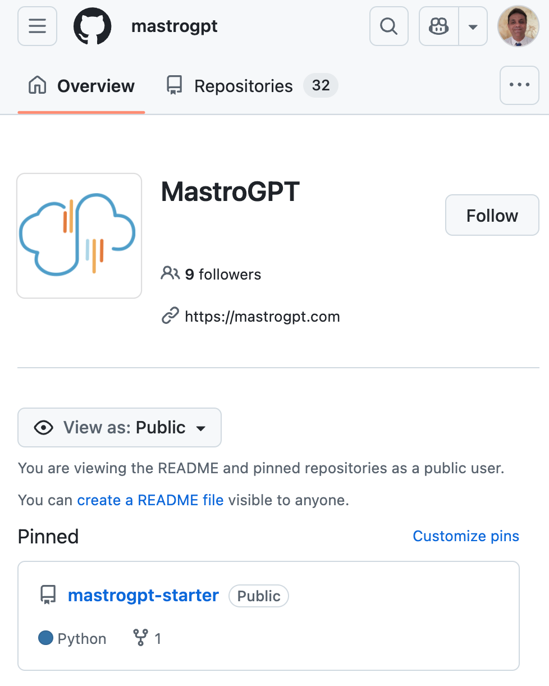
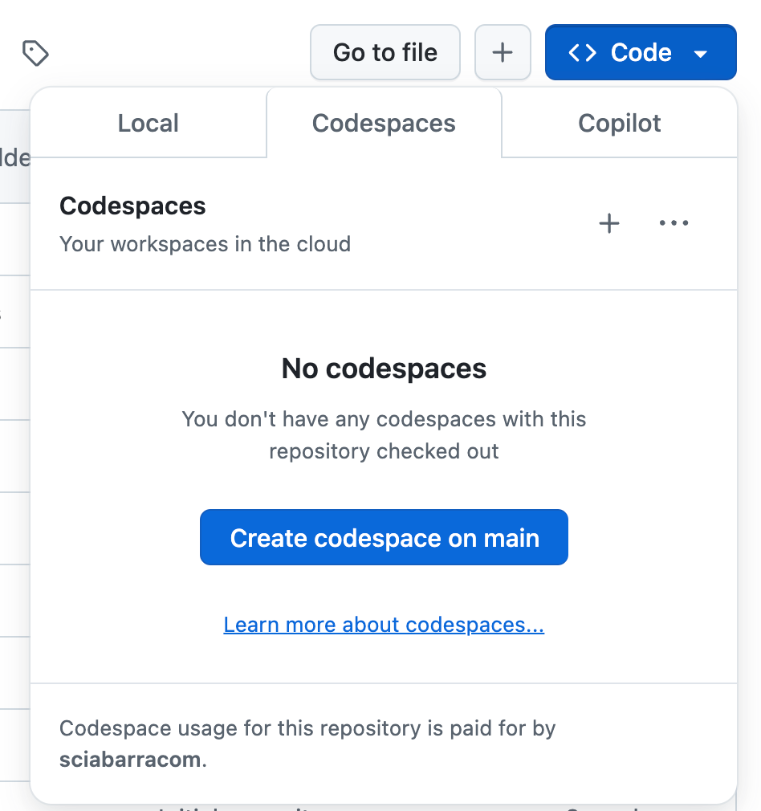
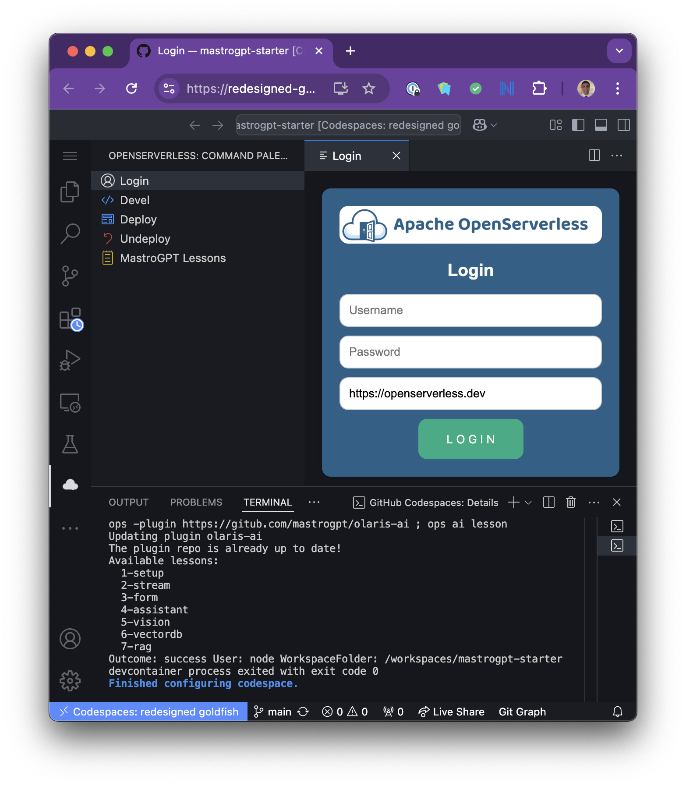
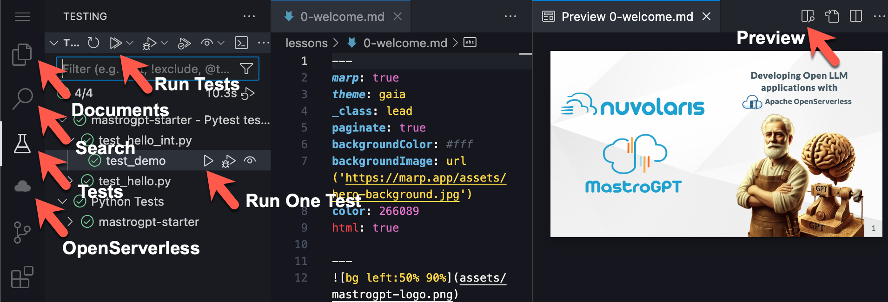
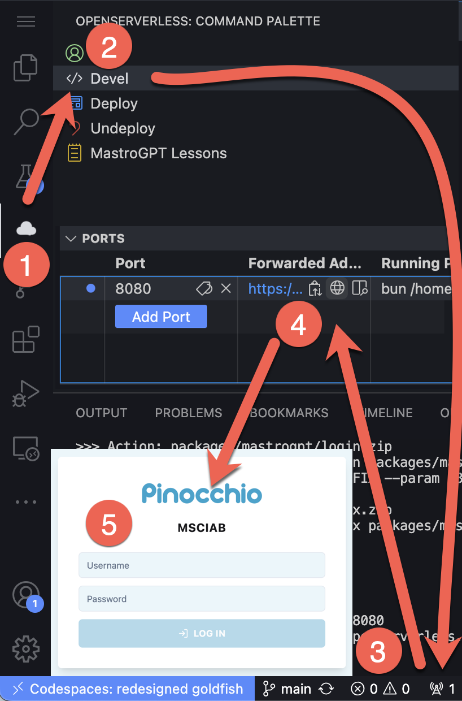
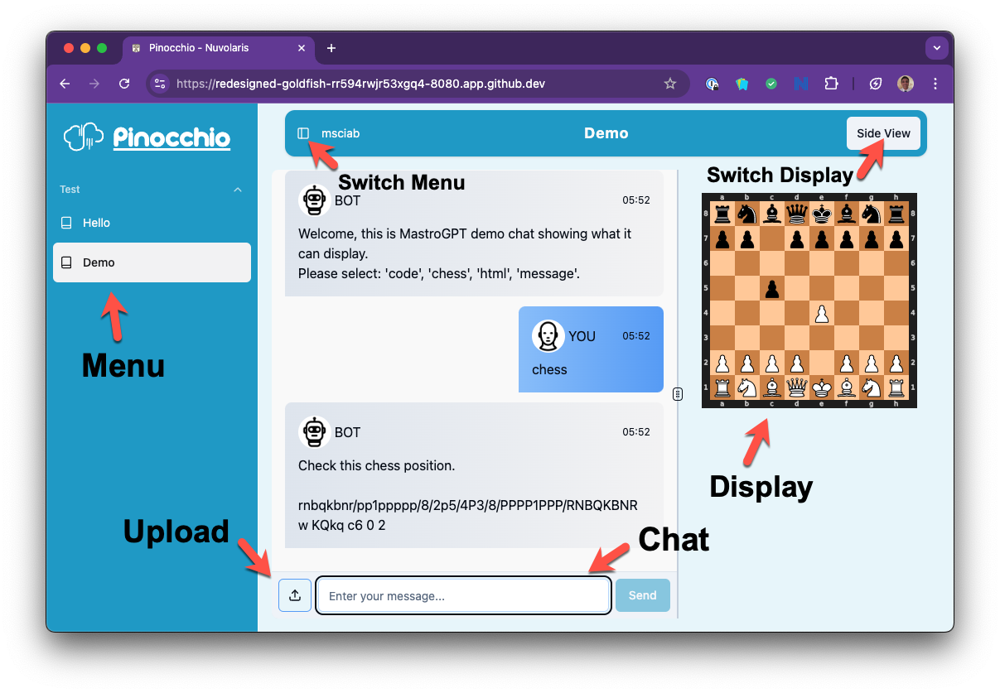

# Welcome to `mastrogpt-starter`

This repository is the starter for the course **Developing Open LLM applications with Apache OpenServerless**, also known as **The MastroGPT course**.

## Prerequisites

You need an up and running instance of [Apache OpenServerless](https://openserverless.apache.org) to deploy and run your code. 

You can:
-  Ask for a free development account on `openserverless.dev` courtesy of [Nuvolaris](http://nuvolaris.io). Contact us:
   - on [MastroGPT.com](https://mastrogpt.nuvolaris.dev) using our chatbot
   - on [Linkedin](https://linkedin.com/in/msciab) sending a private message 
   - on [Discord](https://bit.ly/openserverless-discord) (contact **Michele Sciabarra**)
   - on [Reddit](https://reddit.com/r/openserverless) sending a private message to [msciabarra](https://reddit.com/u/msciabarra)
  
- Self-host it [installing by yourself](https://openserverless.apache.org/docs/installation/)

## Launch a codespace with this starter

First, go to `https://github.com/mastrogpt/` then select the pinned `mastrogpt-starter` repo (you should already be here):

Now launch the codespace on it:

It takes a bit to download images and starts.

Wait until you see the "openserverless icon", then click on the  OpenServerless Icon and finally, click on Login and put your credentials, as follows:

# Overview

You can recognize below the following icons:

On the vertical Activity Bar to the left:

- **Documents** icon
- **Search** icon
- **Tests** icon
- **OpenServerless** icon

In the Testing panel:
- Run Tests
- Run One Test

Now, let's check that everything works.

## Presentation

Open the course slides:

- Click Documents icon
- Open `lessons/0-welcome.md`
- Click on preview icon

You should see the Apache OpenServerless slides.

## Deployment

Deploy the sample code:

- Click on OpenServerless icon then
- Click on Deploy

Deployment should complete with no errors.

## Testing

Run the tests:

- Click on the Tests Icon 
- Run all the tests

All the tests should pass.

**NOTE**: if you don't see any test, it may help to:

- open directly a test file under `tests``
- if you still dont's see the tests, reload the window

# Develoment Mode

Now lets check the development mode and the user interface:

1. `OpenServerless` icon then `Devel` button
1. Open the forwarding
1. Click on the "world" icon
1. Login into Pinocchio
1.  `pinocchio`/`geppetto`

# Terminal commands

There are actually plenty of other commands available on the command line.

Open a terminal (Menu: `Terminal` | `New Terminal`) then try:

1. Change the password: `ops ai user update pinocchio`
1. Redeploy the login `ops ide deploy mastrogpt/login`

You are ready!

