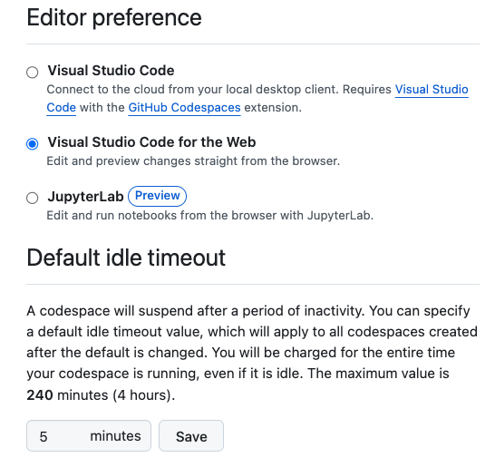

##### Developing Open LLM applications with

<center>

</center>

<center>

</center>


---


https://github.com/mastrogpt/
- Go to `mastrogpt-starter` 
- Launch the codespace


---


## Environment Ready

- It takes a bit to download images and start...

- Wait until you see the *OpenServerless* **Cloud** icon
  
- Click on the **Cloud** icon

- Click on **Login** and put your credentials


--- 

# Check Lesson, Deployment, Tests

- Click on **Cloud** icon then click on **Deploy**

- Click on **Documents** icon, then open the file `lessons/0-welcome.md` and click on the **Preview** icon

- Click on the **Tests** icon, then run all the tests, ensuring all the tess passes

<center>

</center>

---

## Development Mode


1. Click **Cloud** icon 
1. Click **Devel** button
1. Click on **Antenna** icon
1. Click on  **World** icon
1. Login into Pinocchio with `pinocchio`/`geppetto`
1. Play a bit with the UI

---


---

# Pinocchio 


- **Chat** interface to serverless functions (called **actions**)
- **Authentication** with a `login` action
-  **Menu** configurable an `index` action
- **Upload** files in S3 storage
- Customizable **rendering** of content  (`display` action)
- **Form** support

---

## Use the Terminal

- Open the terminal: Menu >> `Terminal` >> `New Terminal`
- Use the terminal to change the password and redeploy the login

```
$ ops ai user update pinocchio
Enter your password: **********
updated /home/msciab/mastrogpt2/starter/packages/mastrogpt/login/users.json
$ ops ide deploy mastrogpt/login
<...omissis...>
ok: updated action mastrogpt/login
```
---


###  Notes on GitHub Codespaces
- Free up to 120 hours
- Recommended: **GitHub** >> **Settings** >> **Codespaces**
- Change: **Default Idle Timout** to 5 minutes
- You can also work locally:
   - wse a local **VScode** 
   - wse a local **Docker** 

---


---


---


#### How to get an account?

Free accounts by Nuvolaris on  `openserverless.dev` 
  - Ask for an account on https://mastrogpt.com
  - Contact us Linkedin, Discord, Email...

#### <!--fit--> https://linkedin.com/in/msciab

You can also self-host it, info: 

##### <!--fit--> https://openserverless.apache.org

---

# <!--fit--> Discord: `bit.ly/openserverless-discord`
<br>
<center>

</center>

---

# <!--fit--> Reddit: `reddit.com/r/openserverless`

<br>
<center>

</center>


---


---
# <!--fit-->  Select a lesson to download


