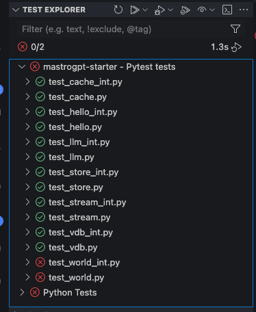
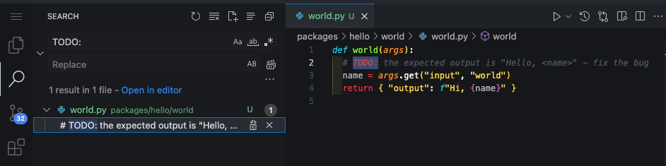
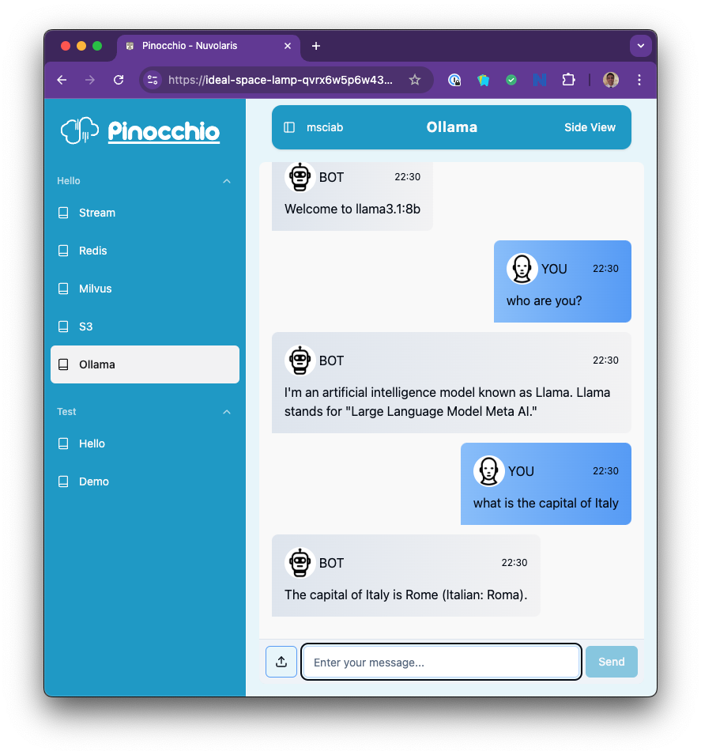
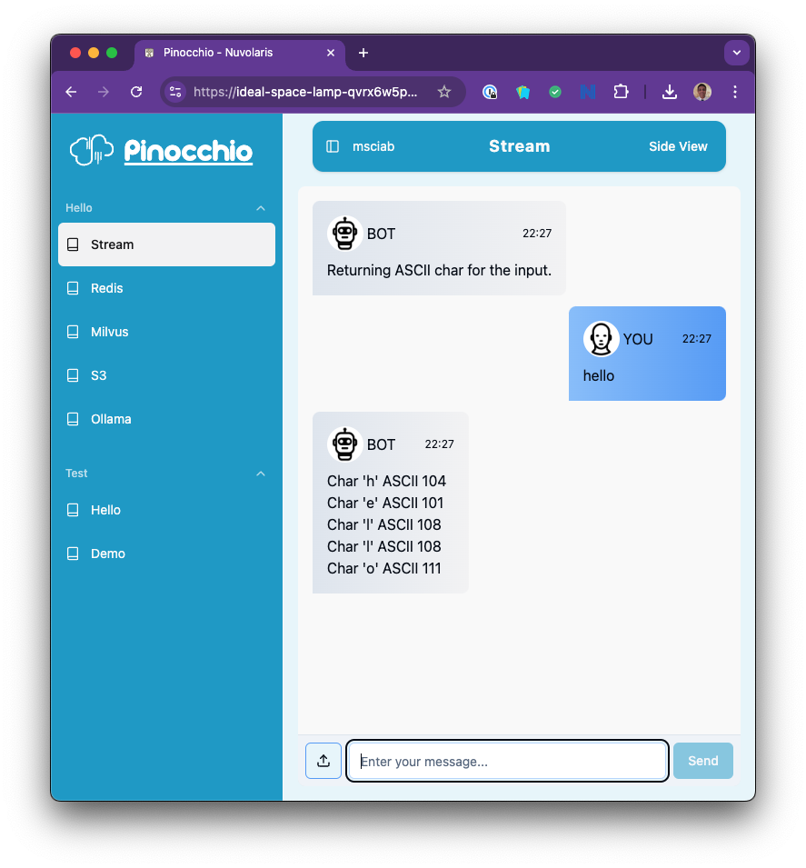
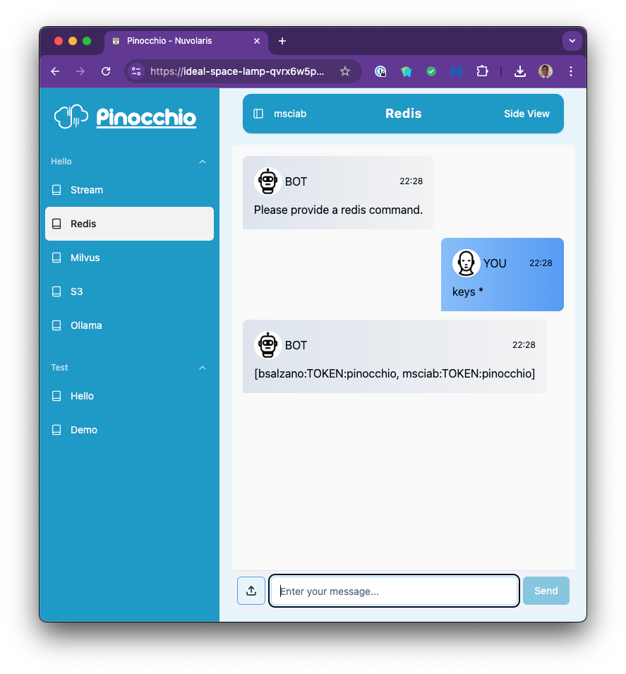
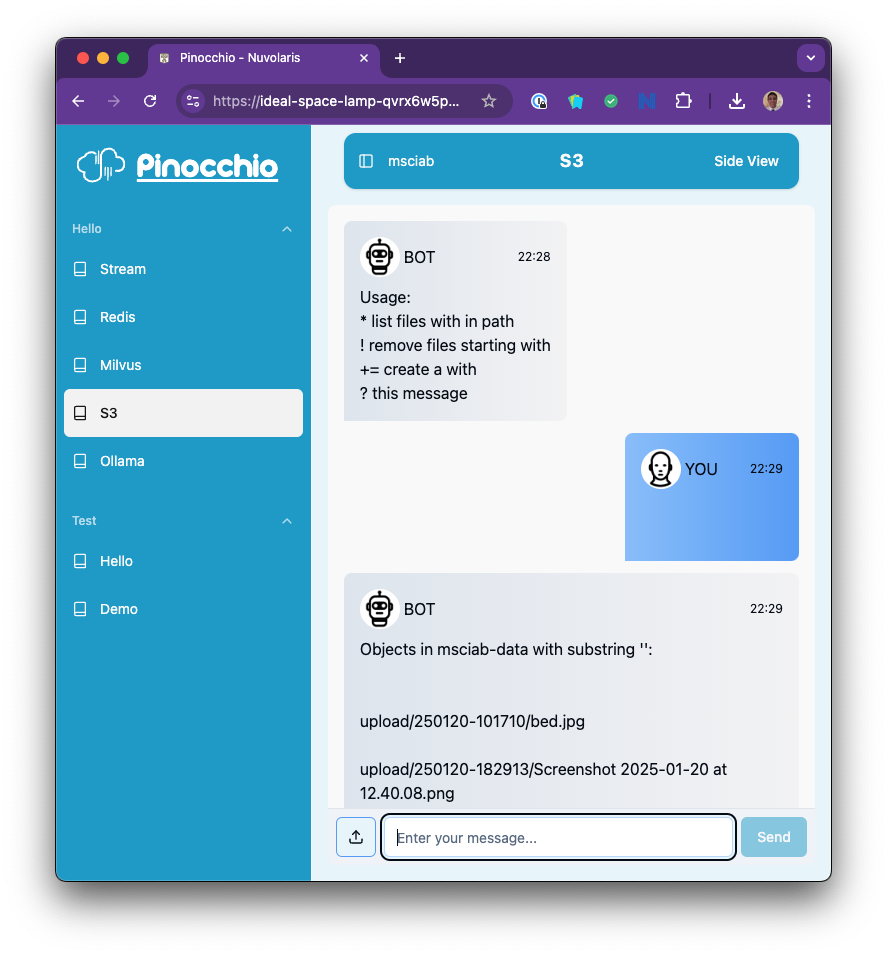
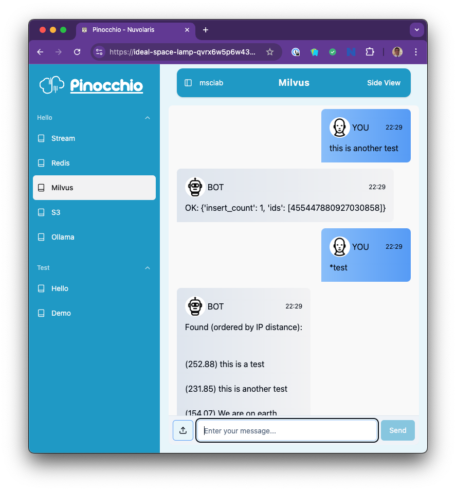
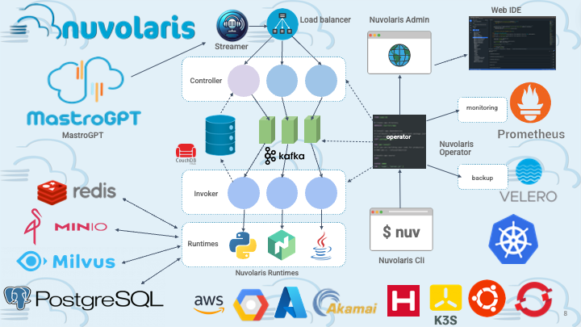
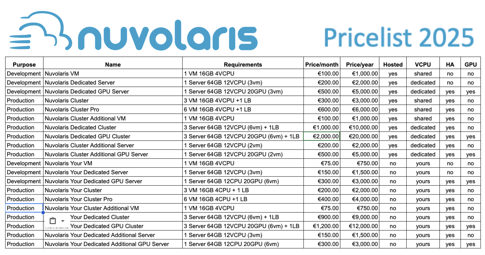

### Developing Open LLM applications with

<center>

</center>

## Lesson 1 

# First Steps

---


### Agenda

- Integrated Services

- Examples: the `hello`s

- CLI tools 

- Exercise: reverse

- About Nuvolaris

- What is next?

---


---



# `hello` package

- Collection samples for all the services
- Launching the tests verifies all the services
- Also useful for interacting and debugging
- Servics are all both `local`  
 and `remote`

--- 
# <!--fit--> Exercise: fixing a failing test (trivial bug)

- Search for the `TODO:` string
- Investigate why a test is failing
- Fix it and run the unit test
- Deploy and run the integration test

<center></center>

---


---


# `hello/llm` 

- Access to the LLM
- Ollama with
  - `llama3.1:8b`
    - powerful small model          
  - `llama3.2-vision:11b`
    - with vision capabilities 
  - `mxbai-embed-large:latest`
    - embedding model 

---



# `hello/stream`

- An example of the streamer
- Return the ASCII of each caratecter
- Stream the input in 1 second interval

----


# `hello/cache`

- Talk directly with REDIS
- Useful for debugging
- Remember there is a required `PREFIX` for the keys!
  - `<username>:`

----



# `hello/store`

- S3 Storage
- Files are uploaded here
- Simple commands:
  - `*<prefix>` list content by prefix
  - `!<prefix>` remove content by prefix
  - `+<file>=<content>` create a file on the fly

---



# `hello/vdb`

- Milvus Vector Database
- Store what you type
- Simple commands:
  - `*<search>` vector search
  - `!<word>` remove entries containing a word


---


--- 
 
 # <!--fit-->`ops` docs on https://openserverless.apache.org

 - It is also self-documenting:

```sh
ops               # main help message
ops -h            # list embedded tools
ops -t            # list tasks 
```
We will use mostly:
- `ops ide`  support 
- `ops ai`   A.I. oriented plugin

---
# `ops` essentials
- basics commands to manage actions

```
ops action list
ops action create reverse lessons/reverse.py
ops invoke reverse
ops invoke reverse input=hello
ops url reverse
curl https://openserverless.dev/api/v1/namespaces/msciab/actions/reverse
ops action update reverse lessons/reverse.py --web true
ops url reverse
curl https://openserverless.dev/api/v1/web/msciab/default/reverse
curl "https://openserverless.dev/api/v1/web/msciab/default/reverse?input=hello"
ops action delete reverse
ops action list
```

--- 
# `ops ide` essentials

- manages packaging and hot-reload
```
ops ide                           # support tools main subcommand
ops ide login                     # login to one openserverless instance
ops ide deploy                    # package and deploy all the actions
ops ide deploy hello/llm          # package and deploy one action
ops ide devel                     # incremental development mode   
ops ide clean                     # clean temporary files
```

---

# `ops ai` essential
- our AI-oriented plugin
```
ops ai                 # help
ops ai lesson          # download lessons and solutions
ops ai user            # update users
ops ai chat            # command line chat
ops ai cli             # the Python REPL 
ops ai new             # create a new service
```
---


---

# <!--fit--> Exercise: implement a `reverse` chat
- `ops ai new reverse msciab`
- implement the code to a reverse  functions
   - read input, return output
   - if empty input, return usage
- `ops ide deploy msciab/reverse`
- Add the service to `packages/mastrogpt/index/90-Tests.json`
- Use it in Pinocchio

---


---



---



---


---

# Lesson 2 - Streaming Chat

 Implementing an LLM chat with streaming support

## More lessons
- Lesson 3: Form Support
- Lesson 4: Building an Assistant
- Lesson 5: Vision Support
- Lesson 6: VectorDB
- Lesson 7: Bulding a RAG

