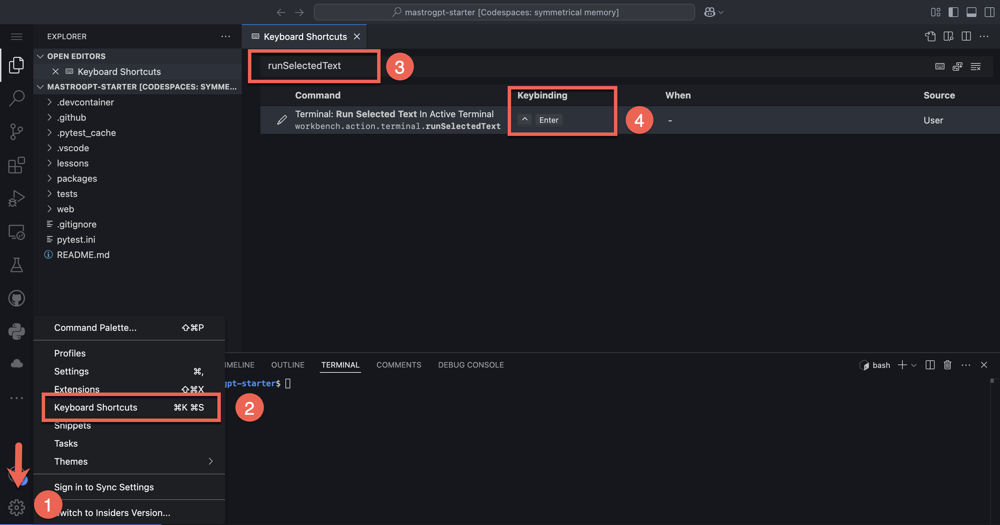
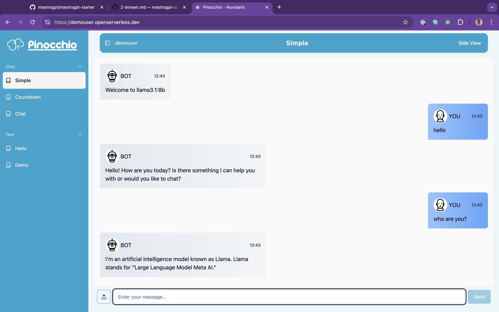
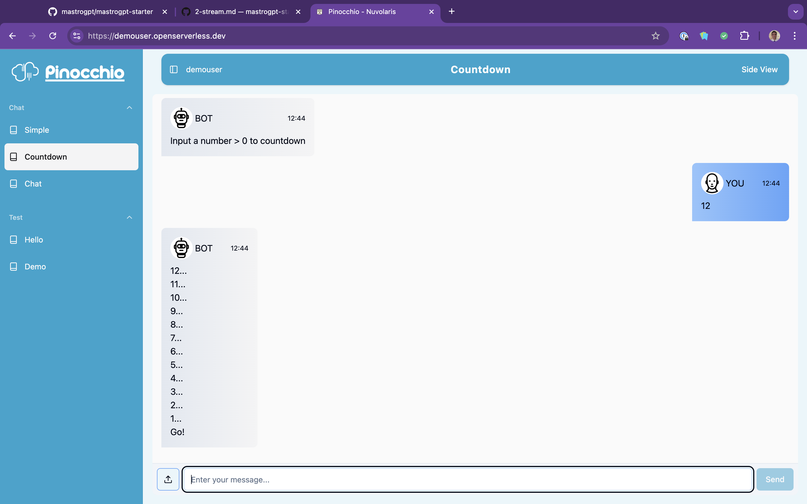

### Developing Open LLM applications with

<center>

</center>

## Lesson 2

# An LLM chat with streaming

---


# An LLM chat with streaming

- Accessing the LLM

- Managing Secrets

- How to stream

- Exercise: Streaming LLM

---



---


---
# Getting credentials

- Credentials are available in the environment:
  - `OLLAMA_HOST` is the url
  - `AUTH` are the credentials
    - **for the dev environment only!**
- Enter the CLI: `ops ai cli`
- Checking you have the credentials:

```python
import os
os.getenv("OLLAMA_HOST")
os.getenv("AUTH")
```

---

# Accessing Ollama

```python
args = {}
host = args.get("OLLAMA_HOST", os.getenv("OLLAMA_HOST"))
auth = args.get("AUTH", os.getenv("AUTH"))
base = f"https://{auth}@{host}/"
```

## Test it!

```
!curl {base}
```
`Ollama is Running`

---

# Talking with a model in Ollama

```python
# using llama 3.1 8 Billions
MODEL = "llama3.1:8b"
inp = "Who are you?"
# preparing a request
msg = { "model": MODEL, "prompt": inp, "stream": False}
url = f"{base}/api/generate"
# making a request
import requests as req
res = req.post(url, json=msg).json()
out = res.get('response', 'error')
print(out)
```

---

# Putting all together in an action

Checking the code:
```
!code packages/chat/simple.py
```

# Deploying the action "manually"

**YOU DO NOT DO THIS WAY - FOR ILLUSTRATION PURPOSE**
```bash
!ops package create chat
!ops action update chat/simple packages/chat/simple.py \
     --web=true --param AUTH {auth} --param OLLAMA_HOST {host}
```

---



---


---

#  From where the `OLLAMA_HOST` and `AUTH` are coming from?

### Multiple places!

- From the config **loaded at the login**
- From the `.env` file
- From the `packages/.env` for actions
- from the `tests/.env` for tests

**(the later override the former)**


---

# Where is `OLLAMA_HOST`?

  - in `tests/.env` for actions
  - in `packages/.env` for tests
```
!grep OLLAMA_HOST packages/.env
!grep OLLAMA_HOST tests/.env
```
`OLLAMA_HOST=ollama.nuvolaris.io`
`OLLAMA_HOST=ollamatest.nuvolaris.io`

### note that they are different!
---

# Where is `AUTH`?

### Is is NOT  in any  `.env`
```
!grep AUTH  packages/.env tests/.env
```
*(no output)*

## It is in the config!
```
!ops -config -dump | grep AUTH
```
`AUTH=<uid>:<secret>`


--- 

# How to propagate secrets to actions

- When you login you get the secrets for deployment

```
!ops -config -dump
```

- You can then propagate the secrets to actions adding:

```
#--web true 
#--param OLLAMA_HOST $OLLAMA_HOST
#--param AUTH $AUTH
```

- Then use `ops ide deploy chat/simple.py`  

---

# Important!

### Tests and CLI see: <br> config, `.env` and `tests/.env`

### Deployment see: <br>  config, `.env` and `packages/.env`

## The *test* variables are **different** from the *deployment* variables
### <!--fit--> In test you use *local* services instead of production ones

---

# Best practices

### Always get secrets from `args` **and**  default `getenv`

```python
host = args.get("OLLAMA_HOST", os.getenv("OLLAMA_HOST"))
```

### <!--fit--> Add the `#--param` in the main file of the action or `__main__`
```
#--param OLLAMA_HOST $OLLAMA_HOST
```
### Pass args to the action deploying with <br> `ops ide deploy [<action>]`

---

# About `ops ide deploy`

- Built on top of `ops actions` and `ops packages`
- Works **currently** only for `python`, `node` and `php`
- Create packages for actions
- Create a zip for multi-file actions
- Resolve Dependencies: `requirements.txt`, `packages.json`
- Extract command line arguments from `#--<arg> <val>`
  - Required to propagate secrets: `#--param AUTH $AUTH`
- Integrates with `ops ide devel` for incremental deploy

---


---

# Let's see the streaming in `ops ai cli`

```python
# prepare
import os, requests as req
url = f'https://{os.getenv("AUTH")}@{os.getenv("OLLAMA_HOST")}/api/generate'
# streaming request
msg = {"model": "llama3.1:8b", "prompt": "Capital of Italy", "stream": True} 
res = req.post(url, json=msg)
```
```python
lines = res.iter_lines()
for line in lines:
  print(line)
```

`b'{"model":"llama3.1:8b","response":"R","done":false}'
b'{"model":"llama3.1:8b","response":"ome","done":false}'`

---

# Countdown generator

```python
import time
def count_to_zero(n):
  while n > 0:
    yield f"{n}...\n"
    n -= 1
    time.sleep(1)
  yield "Go!\n"
```

Test:
```python
for line in count_to_zero(10):
  print(line, end='')
```

---
## To stream we use a socket!
- The action is long running
- We send intermediate results in the socket
- we receive the socket location in `args` as: 
  - `STREAM_HOST` usually fixed
  - `STREAM_PORT` always changing

```python
sock = args.get("STREAM_HOST")
port = int(args.get("STREAM_PORT"))
with socket.socket(socket.AF_INET, socket.SOCK_STREAM) as s:
    s.connect((sock, port)) # double parenthesis NOT error
    # ... prepare a msg in json ...
    s.sendall(json.dumps(msg).encode('utf-8'))
```


---
## The `stream` function for an iterator

```python
import json, socket, traceback
def stream(args, lines):
  sock = args.get("STREAM_HOST") ; port = int(args.get("STREAM_PORT"))
  out = ""
  with socket.socket(socket.AF_INET, socket.SOCK_STREAM) as s:
    s.connect((sock, port))
    try:
      for line in lines:
        msg = {"output": line}
        s.sendall(json.dumps(msg).encode("utf-8"))
        out += str(line) #; print(line, end='')
    except Exception as e:
      traceback.print_exc(e)
      out = str(e)
  return out
```

---
### `streamock`:  a mock to test the stream

```python
import sys; sys.path.append("tests")
import streamock
args = streamock.args()
mock = streamock.start(args)
```

Running the tests:
```python
lines = count_to_zero(10) # extracting the generator
stream(args, lines)       # streaming the generated items
```

Collecting the results:
```python
streamock.stop(mock)
```

---
# `countdown.py` and `test_countdown.py`
```
# WARN: exit for cli to avoid busy ports!
code packages/chat/countdown.py
code tests/chat/test_countdown.py
```
Note the `"streaming": true`to enable streaming
```python
return { "body": { "output": out, "streaming": True } }
```
Checking the test and deploying
```
ops ide deploy chat/countdown.py
ops ide deploy mastrogpt/index
```

---



---


---

# Exercise 1: Add the secrets

You have to add the code to retrieve the secrets from the environment.

Search `TODO:E2.1` add params for accessing and authorizing Ollama access

Hint:

```
#--param XXX $XXX
```

```
args.get("XXX", os.getenv("XXX"))
```

### Result: test_stateless.test_url should pass


---

# Exercise 2: Fix the streaming

You have to change the default streaming function from extracting the response from the answer.

Search `TODO:E2.2` and insert the `stream` implementation, changing:

```python
-msg = {"output": line.decode("utf-8")}
-out += str(line)
+dec = json.loads(line.decode("utf-8")).get("response", "")
+msg = {"output": dec}
+out += dec
```

### Result: test_stateless.test_stream should pass

---

# Exercise 3: model switcher

Search `TODO:E2.3` add if to switch to `llama3.1:8b` or `deepseek-r1:32b` on input 'llmama' or 'deepseek'

- if input is `deepseek` change the model to `deepseek-r1:32b`

- if input is `llama` change the model to `llama3.1:8b` 

Bonus: fix `stream` to replace `<think>` with `[think]` (no hints) 

### Result: test if you can change the model

---


---

# Lesson 3 - Form

Support for form, display and advanced rendering

## More lessons
- Lesson 4: Building an Assistant
- Lesson 5: Vision Support
- Lesson 6: VectorDB
- Lesson 7: Bulding a RAG

