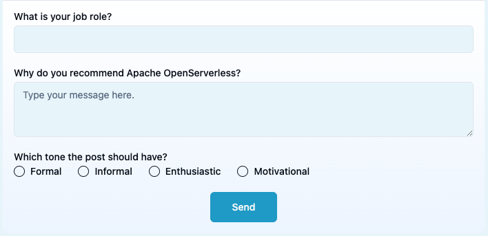

### Developing Open LLM applications with

<center>

</center>

## Lesson 3

## Form and Display support

---


## Form and Display Support

- Authentication

- Form: PostGen

- Display: Puzzle

- Exercise: Custom Puzzle

---


---


---
### Authentication

- Actions are normally *not* directly accessible 
   - action invocation must be authenticated with a key
   - the key is stored in `~/.wskprops`
     - you can "source" it

- an action cab be public ("web action")
   - deploy with `--web true`
   - web action invocation is *NOT* authenticated
     - but you can provide **custom** authentication

### Pinocchio supports custom authentication

---
# Some useful **magic** shell tricks

- When you login, a `~/.wskpros` file is created with an API KEY
- You can load the key with `source ~/.wskpros` (in a bash shell)
- you can get the url with `ops url <action>`
  - extract the last line with `| tail +2`
  - store in a variable with `VAR=$(...)`
  - use POST and the flags `blocking=true` and `result=true`

---
### Action authentication

```
code packages/form/hello.py                               # note NO --web true
ops ide deploy form/hello.py                              # deploy everything
ops url form/hello                               # get url
curl https://openserverless.dev/api/v1/namespaces/msciab/actions/form/hello
```
`{"code":"IcWTiEX6DsWKXUmO3AlswEoPvSG5A8wS","error":"The resource requires authentication, which was not supplied with the request"}`

```
source ~/.wskprops                             # loading AUTH
URL=$(ops url form/hello | tail +2)            # get URL
FLAGS="blocking=true&result=true"              # additional flags
curl -u $AUTH -X POST "$URL?$FLAGS"
```
`{"body":"Hello, world"}`

---
## Custom authentication

- Pinocchio uses public **web actions**
  - by default they are **UNPROTECTED**
  - **WARNING**: *you can access them freely if you know the URL*

```
code packages/form/auth/__main__.py
ops ide deploy form/auth
URL=$(ops url form/auth | tail +2)
curl $URL
```

`
{
  "output": "you are authenticated"
}
`

### However it supports an **authentication token**

---

# Pinocchio auth token 

- Invoke from Pinocchio  `Form/Auth`  and check logs
  
`
Token: pinocchio:Z_DaI31ONacHEDjzznBpJW0jDjyBuNWKjDfwZGCm0qY
`

Look in Redis:

```
get msciab:TOKEN:pinocchio
```
`Z_DaI31ONacHEDjzznBpJW0jDjyBuNWKjDfwZGCm0qY`

---
# Auth code

```python
import os, redis
def unauthorized(args):
  [user, secret] = args.get("token", "_:_").split(":")
  rd = redis.from_url(args.get("REDIS_URL", os.getenv("REDIS_URL")))
  check = rd.get(f"{args.get("REDIS_PREFIX", os.getenv("REDIS_PREFIX"))}TOKEN:{user}") or b''
  return check.decode("utf-8") != secret
```

Checking:

```python  
def auth(args):
  # print("Token:", args.get("token", "<none>"))        # comment this 
  if unauthorized(args):
    return { "output": "you are not authenticated" }
  return { "output": "you are authenticated" }
```

---


---
# Form Field: a dictionary 
  - `label`: the description
  - `name`: the field used in the input
  - `required`: is it required?
  - `type`: can be `text`, `textarea`, `checkbox`, `radio`, `file`
  - if `radio`:
     - `options`: array of options 
  - if `file`:
     - upload a (small!) file in base64
---
### Example Form

```python
FORM = [{
  "name": "why",
  "label": "Why do you recommend Apache OpenServerless?",
  "type": "textarea",
  "required": "true"
  }, {
  "name": "job",
  "label": "What is your job role?",
  "type": "text",
  "required": "true"
  }, {
  "name": "tone",
  "label": "What tone should the post have?",
  "type": "text",
  "required": "true"
}]
```

---

### Return a `form` field with a list of fields

```python
return {
  "form": FORM                          # request a form 
  "streaming": True                     # enable streaming
  "output": "Please fill a form"        # output
}
```
<center>

</center>

---

# Process a form

```python
# get the input field
inp = args.get("input", "")
# ensure it is a dictionary with a 'form' field
if type(inp) is dict and "form" in inp:
     # get the form data
     data = inp["form"]
     for field in data.keys():
        # get the value of the field
        value = data[field]
        # do something with it
        print(value)
```

---

# Prompt engineering

```python
if type(inp) is dict and "form" in inp:
  # get the form data
  data = inp["form"]
  inp = f"""
Generate a post promoting Apache OpenServerless.
Your job role is {data['job']}.
The reason because you are using Apache OpenServerless is {data['why']}.
The tone of the post should be {data['tone']}.
"""
  out = chat(args, inp)
```

---


---
## How to implement a display?

- Rule: every anwer with  *unknown* keys is forwarded to the `mastrogpt/display`
  -  Known keys are: `output`, `state` and `form`

## Example: generating a chess position
```
!ops invoke mastrogpt/demo input=chess | jq .body | tee chess.json
!ops invoke mastrogpt/display -P chess.json
```
 `jq` extracts the body, `tee` saves in a file, `-P` reads params from file


---
# Ask for a chess `puzzle` in FEN format

```python
  res = {}
  if inp == "puzzle":
    inp = "generate a chess puzzle in FEN format"
    out = chat(args, inp)
    fen = extract_fen(out)
    if fen:
       print(fen)
       res['chess'] = fen
    else:
      out = "Bad FEN position."
```
### Using `phi4`, as `llama` generates bad FEN strings


---
#  FEN extraction from LLM output

Regular expression surgery:

```python
def extract_fen(out):
  pattern = r"([rnbqkpRNBQKP1-8]+\/){7}[rnbqkpRNBQKP1-8]+"
  fen = None
  m = re.search(pattern, out, re.MULTILINE)
  if m:
    fen = m.group(0)
  return fen
```

### It is very common to extract output with regexps

---


---
# Exercise: Custom Puzzle

- Modify the `puzzle` command to show a form to customize the puzzle.
- Change the prompt to ask for a puzzle with the selected pieces
<center>

</center>

Check the solution with: `ops ai lesson 3-form --solution`
