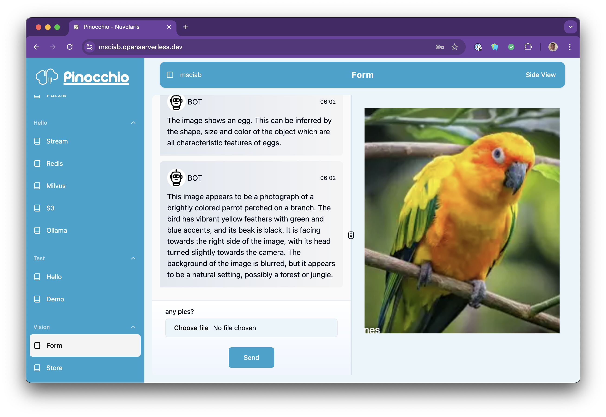
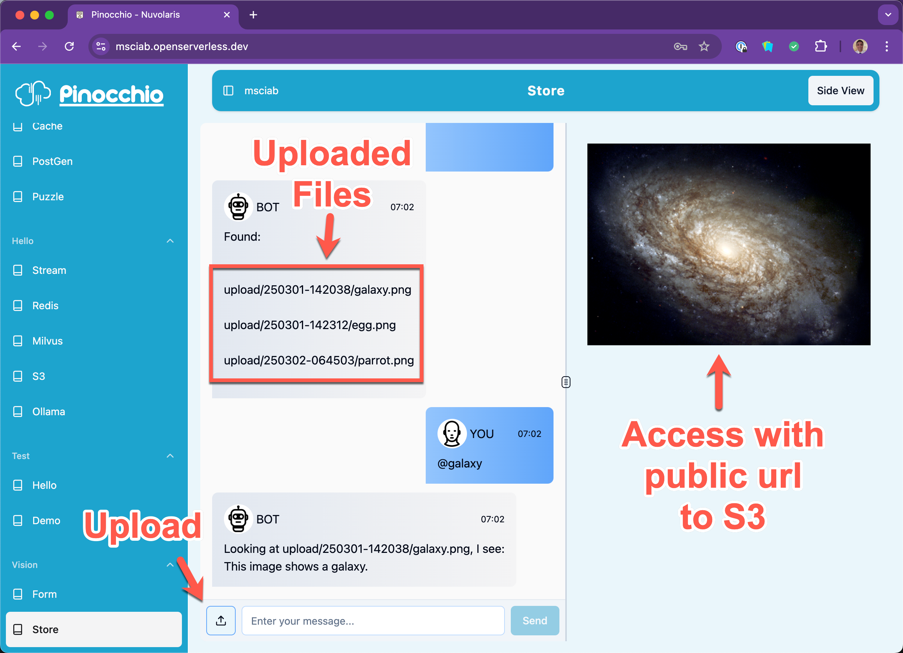

### Developing Open LLM applications with

<center>

</center>

## Lesson 5

## Vision and Storage 


---


## Vision and Storage

- Analyzing Images

- Vision Form action

- Managing S3 Storage

- Vision Store action

---


---
# Analizing an image with Ollama 1/3

- Ollama Endpoint:  `https://<url>/api/chat`

```python
import os, pathlib, base64, requests as req, json
# url to access ollama
url = f"https://{os.getenv("AUTH")}@{os.getenv("OLLAMA_HOST")}/api/chat"
```

- read image in base64
```python
body = pathlib.Path("tests/vision/cat.jpg").read_bytes()
iimg
mg = base64.b64encode(body).decode()
```

---

# Analizing an image with Ollama 2/3

- Use a vision model: `llama3.2-vision:11b`

- Post an image `img` in base64 format:

```python
msg = {
    "model": 'llama3.2-vision:11b',
    "messages": [ {
        "role": "user",
        "content": "what is in this image?",
        "images": [img]
    } ]
}
```

---
# Analizing an image with Ollama 3/3

- showing one line of the answer

```python
# get vision answer streamed
lines = req.post(url, json=msg, stream=True).iter_lines()
next(lines)  # showing one line
```

- streaming all the result
```python
for line in lines:
    chunk = json.loads(line.decode("UTF-8"))
    print(chunk.get("message", {}).get("content", ""), end='')
```


---


---



---
## File Upload


- Form to upload a file:

```python
FORM = [{
    "label": "any pics?",
    "name": "pic",
    "required": "true",
    "type": "file"
}]
```

- Retrieve base64 encoded image:

```python
  if type(inp) is dict and "form" in inp:
    img = inp.get("form", {}).get("pic", "")
```
---
## Base64 Image Display

- You can display an image in base64 format with:

```html
'>
```

- Using Pinocchio  Display support

  - You can embed an HTML snippet to be rendered

```html
res['html'] = f''
```

---

# Vision Store Action

- A Vision Class

```
!code packages/vision/form/vision.py
!code tests/vision/test_form.py
```

- The Vision Form action
```
!code packages/vision/form/form.py
```

---


---
# S3 Endpoints

**WARNING!** confusing topic, there are **three** S3 end points!

- Internal DEPLOYMENT endpoint `http`, `S3_HOST` and `S3_PORT` 
  - provided by the login
- Internal TEST endpoint: `http`, `S3_HOST` and `S3_PORT` in test
  - configured in `tests/.env`
- External DEPLOYMENT endpoint: `https://s3.openserverless.dev`
  - variable `S3_API_URL`

---

# S3 endpoint

```python
import os
args = {}
# endpoint
host = args.get("S3_HOST", os.getenv("S3_HOST"))
port = args.get("S3_PORT", os.getenv("S3_PORT"))
url = f"http://{host}:{port}"
# bucket
bucket = args.get("S3_BUCKET_DATA", os.getenv("S3_BUCKET_DATA"))
external_url = args.get("S3_API_URL") # not available in test
```

- Internal Deploy: `!ops -config -d | grep S3`
- Internal Test: `!grep S3 tests/.env`

---
# Connecting to the client

```python
import os, boto3, base64, pathlib

key = args.get("S3_ACCESS_KEY", os.getenv("S3_ACCESS_KEY"))
sec = args.get("S3_SECRET_KEY", os.getenv("S3_SECRET_KEY"))
client = boto3.client('s3',
   endpoint_url=url,  region_name='us-east-1', 
   aws_access_key_id=key, aws_secret_access_key=sec)
```

---
## S3 Read and Write objects

### write:
```python
body = pathlib.Path("tests/vision/cat.jpg").read_bytes()
client.put_object(Bucket=bucket, Key="cat.jpg", Body=body)
````

### read:
```python
res = client.get_object(Bucket=bucket, Key='cat.jpg')
data = res["Body"].read()
```

---

# Listing a bucket and deleting objects

### list:

```python
res = client.list_objects_v2(Bucket=bucket)
'Contents' in res
res['Contents']
```

### delete:

```
### delete:
```python
client.delete_object(Bucket=bucket, Key='cat.jpg')
```

---


---



---
# Showing Images from S3

- You need to create a **signed** url for temporary access
```python
client.put_object(Bucket=bucket, Key="cat.jpg", Body=body)
url = client.generate_presigned_url('get_object',
  Params={'Bucket': bucket, 'Key': 'cat.jpg'}, ExpiresIn=3600)
```

- Fixing the url for external access:
```python
external_url = "https://openserverless.dev" 
from urllib.parse import urlparse, urlunparse
old = urlparse(url) ; pref = urlparse(external_url)
url = urlunparse((pref.scheme, pref.netloc, 
                  old.path, old.params, old.query, old.fragment))
```

---

# Vision Upload action

- A `Bucket` Class

```
!code packages/vision/store/bucket.py
!code tests/vision/test_store.py
```

- The Vision Form action
```
!code packages/vision/store/store.py
```

---

# Exercise: 

Modify the `vision/form` to store the uploaded files on S3

Hints:
- add the `bucket.py` module to the form
- save the file after decoding it in base64
- generate an unique name using the timestamp
- change the htmo to use the value returned by `exturl` 


