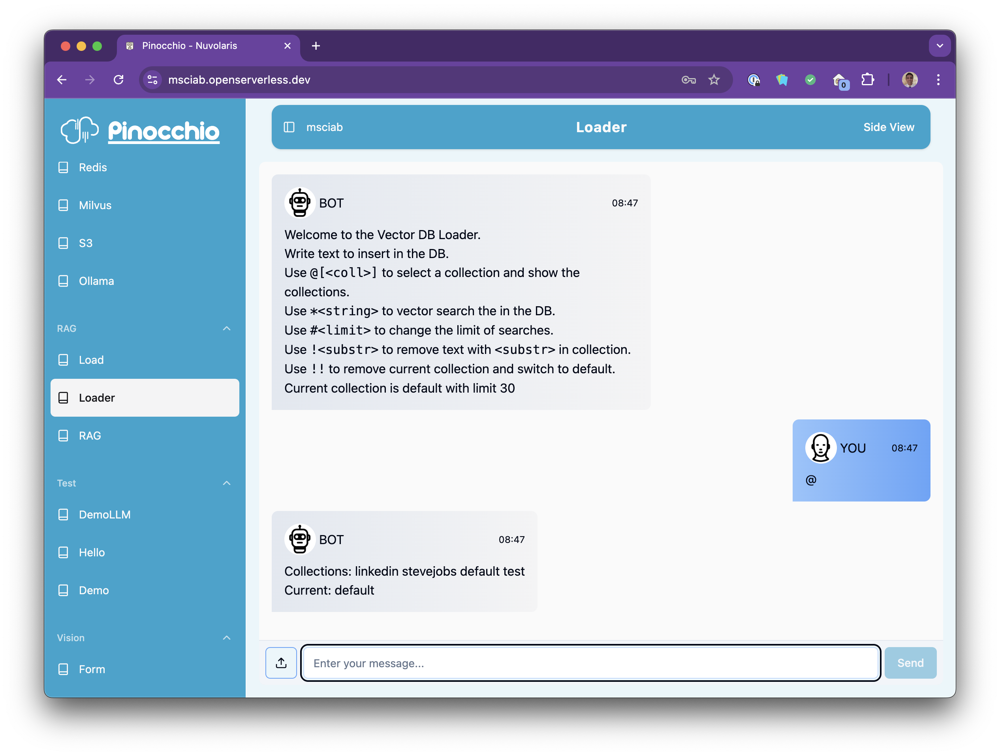
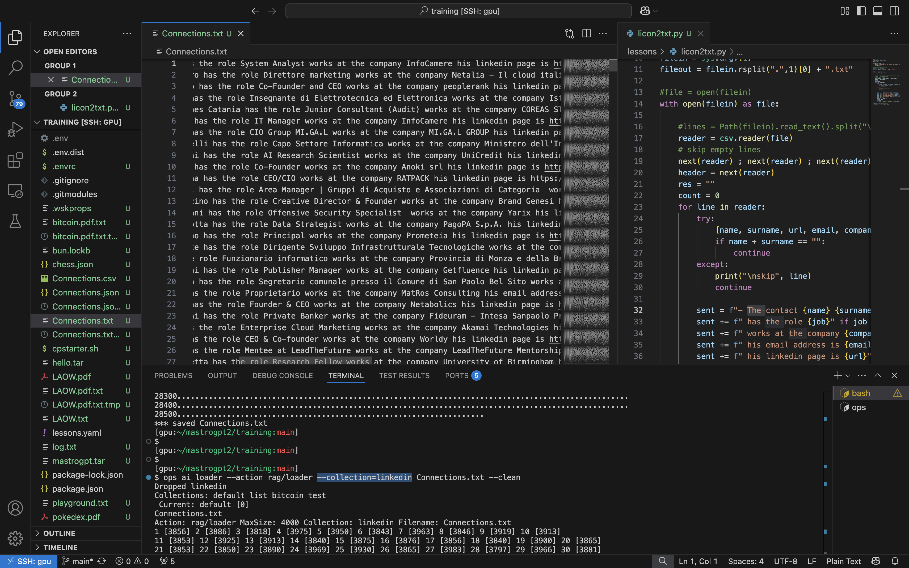
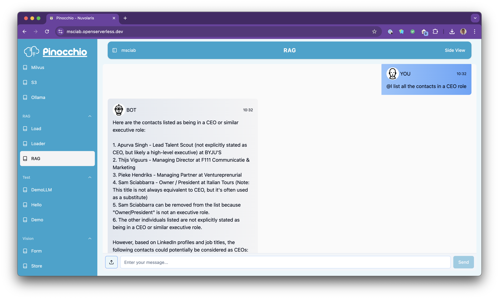

### Developing Open LLM applications with

<center>

</center>

## Lesson 7

##  A RAG system

---


## A RAG system

- Implementing a RAG

- VectorDB loader for PDF documents

- A multi document, multi LLM RAG action 

---


---
# RAG Concepts

- RAG is an acronym: 
   - Retrieval-Augmented Generation

  - You augment your questions with context informations automatically provided

- You use your question to find relevant content

   - Embedding creates "semantic" vectors

   - Search the relevant content with Vector Search

---

# Initializing VectorDB

```python
import sys ; sys.path.append("packages/rag/rag")
import rag, vdb
```

Insert some content
```python
args = {}
db = vdb.VectorDB(args, "jobs")
db.remove_by_substring("")
db.insert("Lisa is the first daughter of Steve Jobs.")
db.insert("Lisa full name is Lisa Brennon.")
db.insert("Jobs named his masterpiece computer after Lisa name.")
db.insert("Lisa name is is inspired by Mona Lisa.")
````

---
# Creating a Context

Vector Search:
```python
res = db.vector_search("Lisa")
res
```

Creating a context:

```python
context = "Consider the following text:\n"
for i in res: context += f"{i[1]}\n"
context += "Answer to this prompt:\n"
print(context)
```
---

# Query the LLM with Context
```python
import rag
MODEL="llama3.1:8b"
question = "Who is Lisa?"
```

Without Context:
```python
print(rag.llm(args, MODEL, question))
```
With context:
```
print(rag.llm(args, MODEL, context+question))
```

---

# Best Practices for RAG

- Create significant chunks: 

  - Typically 500-800 words, around 4000 characters

  - Better if they are semantically related

- Consider the context size:
  
   - `llama3.1:8b`  has 128k context 
   - so you can put around 30 chunks

- It is **essential** to structure the content properly for searches

---


---
## RAG loader

A action to load the Vector DB:

```
Welcome to the Vector DB Loader.
Write text to insert in the DB. 
Use `@[<coll>]` to select a collection and show the collections.
Use `#<limit>`  to change the limit of searches.
Use `*<string>` to vector search the <string>  in the DB.
Use `!<substr>` to remove text with `<substr>` in collection.
Use `!![<collection>]` to remove `<collection>` and switch to default.
```
- support multiple collections
- allows direct input of content
- also test searches and remove content and collections

---


---

# Rag Loader CLI

- Parses PDF in Text
- Import text in chunks 

```
$ ops ai | grep loader
ai loader [--action=<action>] [--chunksize=<size>] 
          [--collection=<name>] [--clean]
          <file>...
```

Use `--action=rag/loader` to select the loader action
Use `--collection=<name>` to select collection 
Chunksize defaults to 4000

---



---
# RAG Loader code

Loader Action

```
!code packages/rag/loader/loader.py
```

VectorDB Class

```
!code packages/rag/loader/vdb.py
```

---


---
# RAG Query

- Extract text from DB and ask an LLM
- Supports multiple LLM, batch sizes and collections

```
Start with `@[LPM][<size>][<collection>]` 
 to select the model then add `<size>` sentences 
 from the `<collection>` to the context.
Models: L=llama P=phi4 M=mistral.
You can shorten collection names, 
it will use the first one starting with the name.
Your query is then passed to the LLM 
with the sentences for an answer.
```

---




---

# RAG Query code

Parser
```
code packages/rag/rag/rag.py -g 20
```
Action
```
code packages/rag/rag/rag.py -g 110
```

---
# Final Exercise

Modify the RAG loader to import images

- Modify the Database to accept also an image

- When an image is uploaded, process the image with image recognition and store its descritption

- Modify the RAG to be able to find images by their description
